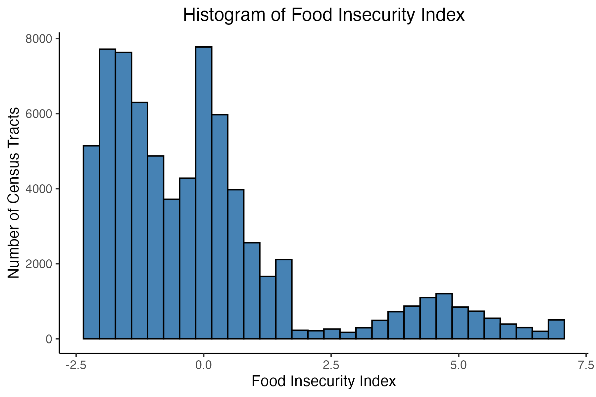
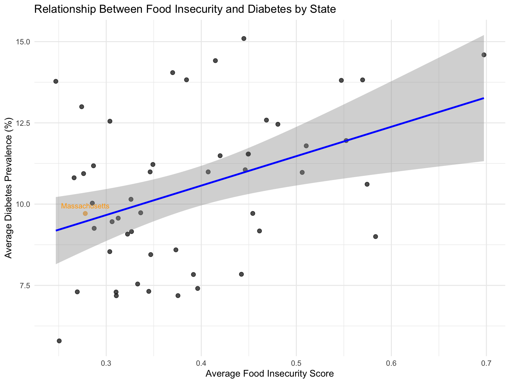
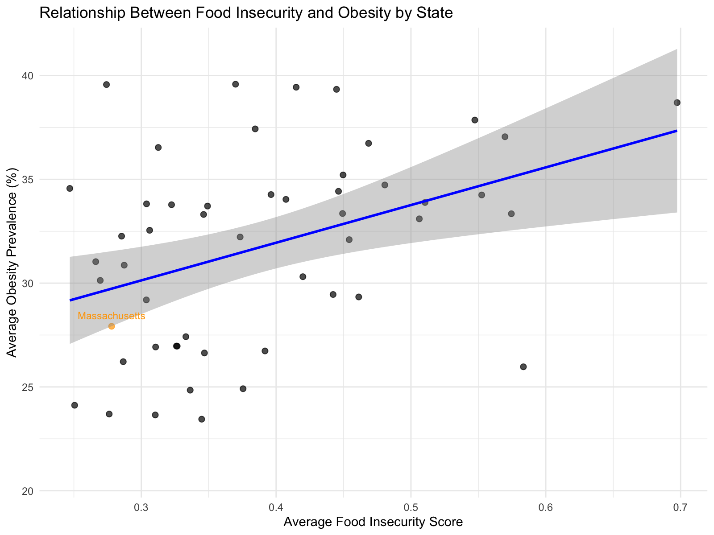
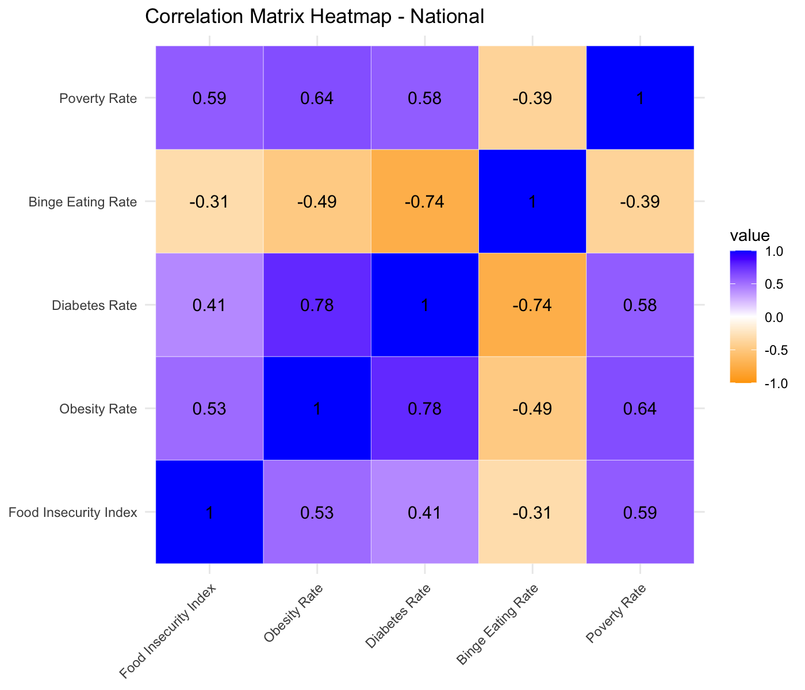
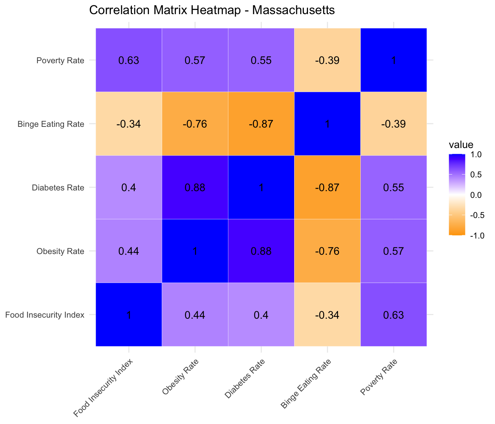

Team 1 Final Project: The Adverse Effect of Food Insecurity on Health Outcomes for Massachusetts Residents
================
Devanae Allen, Emily Broderick, Mia Raineri, Laurel Urwick

# Introduction

Our team analyzed how disparities in food access relate to variation in community health outcomes across the United States with a focused comparison between national trends and those observed in Massachusetts. By using census-tract level data from the CDC PLACES dataset (CDC.gov) and the USDA Food Access Research Atlas (USDA.gov), we examined these relationships at the national, state, and even the city level. Health outcomes studied include rates of obesity, diabetes, and binge eating, while the Food Insecurity Index considers low income low access tracts, urban low access tracts, and the poverty rate.

Our main decision maker is the Massachusetts Department of Public Health (DPH), whose mission is to “promote and protect health and wellness and prevent injury and illness for all people, prioritizing racial equity in health by improving equitable access to quality public health and health care services and partnering with communities most impacted by health inequities and structural racism” (Mass.gov). By analyzing food access and health outcomes, and comparing Massachusetts to national trends, our research supports identifying where resources should be directed, such as toward food programs, grocery development, and other community health efforts. These findings can help guide targeted policy recommendations that better address food insecurity and related health challenges for key populations in Massachusetts.

# Data Summary

To understand how food insecurity affects Massachusetts residents, our group looked to two very reputable sources:

## 1) USDA Food Access Research Atlas
This dataset contains approximately 144 variables on food access, geographic indicators, and socio-economic indicators. The dataset follows the Census tract, meaning that it contains observations for each county in the United States in 2019– the last time the Food Atlas was updated. Some variables of interest include the low income-low access (LILA) tracts, low-access (LA) tracts, poverty rate, SNAP participation, income, and race descriptors.

## 2) CDC’s PLACES 500 Cities
This dataset contains 40 specific chronic disease indicators, behaviors, and preventative care measures, providing more local data to improve health care outcomes. The dataset also follows the Census tract, which allows for easy merging of data and comparison between city, state, and national levels. Some variables of interest include chronic health conditions like obesity, diabetes, and binge eating.
When we say “census-tract level data,” we are referring to the way in which the data was collected across the United States by the Census Bureau. Census tracts create statistical neighborhoods that are small, relatively permanent geographic areas (Lampe). Therefore, when data is collected in this way, we are able to track changes over time to the same geographic areas (i.e. demographics, income, poverty, housing, etc).

You can find the merged PLACES and USDA Food Atlas datasets titled “merged_dataset.csv” on Github.

## Analytic Tools

### R and RStudio

We used R to clean and merge the datasets and create some visualizations. The datasets were cleaned to remove raw counts, irrelevant variables to our analysis, and unnecessary, missing, or NA values in order to reduce the final file size below GitHub’s 50 MB limit. Census tract identifiers (CensusTract and TractFIPS) were used to merge the datasets. Visualizations created in R include a histogram of our Food Insecurity index, a table of descriptive statistics for KPIs, scatter plots of the food insecurity index on health markers, and finally a correlation heat map. We also used R to create some simple linear regression models that help to quantify the results seen in our visualizations.

### Tableau

We used Tableau to create additional visualizations using the merged dataset from R. We found that it was a useful tool for producing choropleths at the state and national level, as well as scatterplots. 
### Tableau Public Links

These dashboards include our interactive visuals on food insecurity and health outcomes, designed for decision makers to explore key trends at the National vs. State-level.

[Physical Health and Poverty](https://public.tableau.com/app/profile/emily.broderick/viz/PhysicalHealthandPoverty/PhysicalHealthandPoverty?publish=yes)

[Food Insecurity Overview](https://public.tableau.com/app/profile/laurel.urwick/viz/shared/4BGKJ74N5)

[Food Insecurity Structural Risk Dashboard](https://public.tableau.com/app/profile/mia.raineri/viz/LILAtracts/insight1?publish=yes)

[LILA versus LA Comparison](https://public.tableau.com/app/profile/mia.raineri/viz/LILAtracts2/Dashboard1?publish=yes)

[Low Access x Health Outcomes by Race](https://public.tableau.com/app/profile/mia.raineri/viz/HealthOutcomesandRace/Dashboard3?publish=yes)

[Massachusetts Health & Poverty](https://public.tableau.com/shared/6Y3T439KP?:display_count=n&:origin=viz_share_link)


# Analytic Overview

This section provides an analytical overview of a few variables of interest in both datasets. Basic summary statistics will be discussed below for the steps taken to construct a Food Security Index as well as key performance indicators (KPIs). We will also explore various relationships between food access and chronic health condition variables by providing basic scatterplots and correlation heat maps. We utilized R to conduct most of our statistical analyses.


## 1. Food Insecurity Index

The food security index was created based off of previous research in the field, which identify risk factors by the four pillars of food security: availability, access, utilization and stability (World Bank Group). Examples of risk factors include household resources  (income, poverty level), food access (transportation, food assistance like SNAP), and demographics (race, disability). Since we have access to many of these variables, we created an index that specifically speaks to the question of access from an economic and geographic perspective:
  - Poverty rate: represents the percentage of individuals in a census tract living below federal poverty threshold. To reduce the influence of extreme outliers, the poverty rate was windsorized at the upper and lower bounds (95% CI)
  - Low income low access (LILA) 1 and 10 mile tract: this tract simultaneously meets the low income criteria and low access to grocery stores for urban (1 mile) and rural (10 mile) populations. 
  - Low access (LA) 1 mile tract: this tract at the 1-mile threshold identifies tracts where food access is independent from the low income indicator.

Variables like income, race, and transportation can be leveraged independently from the index itself, as you will notice in our visualizations and regression analysis.

To create this element in R, we combined our variables using the scale() function, which standardizes numeric data through Z-score normalization. Therefore, the mean of the data is centered around zero and the standard deviation is scaled to one. This was our approach for the index since we are comparing variables on different scales, units, and ranges. It also makes the index much easier to interpret with regards to its practicality. Here is the code in R:

```{r}
# Creating a Food Insecurity Index - Z-score scale
merged <- merged %>%
  mutate(
    food_insecurity_index = rowSums(
      cbind(
        scale(PovertyRate_new),
        scale(LILATracts_1And10),
        scale(LATracts1)
      ),
      na.rm = TRUE
    )
  )
```

In addition to the index, we also created a score that rescaled the indicators to a 0-1 scale, combined them, and then within most calculations the score was averaged to create an overall 0-1 scale. This was used primarily in the creation of our national level scatterplots. We created the two scores as a z-score index is best for regressions and comparing variation across tracts, but the 0-1 scaled score is best for interpretability in the national Tableau scatterplots. The code in R is below:

```{r}
#Creating Food Insecurity Score - 0-1 scale
data$LILATracts_scaled <- rescale(data[["TractLOWI"]], to = c(0,1))
data$TractLOWI_scaled <- rescale(data[["LILATracts_1And10"]], to = c(0,1))
data$PovertyRate_scaled <- rescale(data[["PovertyRate"]], to = c(0,1))

data$FoodInsecurity Score <- data$LILATracts_scaled + data$TractLOWI_scaled + data$PovertyRate_scaled
```

## 2. Key Summary Statistics (KPIs)

Below you will find a descriptive statistics table that provides a high-level overview of our main variables. We can infer a few things about our health outcomes, food access variables, and socio-economic indicators by studying the results.


### Health Outcomes

The obesity rate has a mean of 30.5% and a standard deviation of 8.2, meaning that obesity can vary greatly across tracts but clusters at the 30% mark. The skew of 0.43 is a low positive skew with only a few outliers at the top pulling up the mean. The diabetes rate reports lower values with a mean of 10.8% and standard deviation of 4.3, but a moderate right skew (0.93) tells us it is more disproportionate than obesity rates.  Finally, the binge eating rate has a mean of around 18.07% for all census tracts and reports both low skew and standard deviation.

### Food Access

The LILA rate has a mean of 0.13, telling us that only 13% of tracts can be classified as “low income, low access.” On the other hand, the LA rate is 0.34, meaning that 34% of tracts, urban and rural, can be classified as low access. Therefore, we can see the food insecurity picture a little bit more clearly, as food access may not be completely described by lack of resources or access alone. The food insecurity index is uniquely situated at a mean of 0 and has a standard deviation of 2.05. A skew of 1.47 tells us that a small number of tracts have very high food insecurity, and the negative values in the distribution tell us the tracts that have levels below the average. Understand that the values for the index indicate how many standard deviations above or below the tract is from the average.

### Socioeconomic Indicators

Poverty rate has a mean of 14.9% and a standard deviation of 11, telling us that there are some tracts with high poverty rates (max is 45%) pulling up the mean. Median income is around $77,000 but with a high skew of 1.45, suggesting large income inequality in the US. In general, there is a wide distribution of people represented in the data, which we hope contributes to meaningful results in understanding the interplay between food, health, and poverty.

## 3. Exploring relationships between variables

To quickly check how the food insecurity index compares to our KPIs, let’s visualize what the distribution of our index looks like and then use a scatterplot to measure the relationship to obesity, diabetes, and binge eating. 

### Histogram of Food Insecurity Index



Looking at the histogram of the food insecurity index, we see a range of both positive and negative values. This index is unique because negative values allow us to locate census tracts that have a food insecurity score below the average (which is centered at zero). There happens to be a large cluster of the census tracts ranging from -2.5 to 2.5, showing that the majority of the dataset is distributed around our mean as we would hope. However, there is the instance of outliers well beyond the 2.5 mark, which is what creates the large right tailed skew in our distribution. It will be important to keep in mind how our results may be shaped by these outliers.

### Scatterplot of Food Insecurity and Diabetes



This scatterplot reflects the relationship between food insecurity and the prevalence of diabetes nationally. There is a positive correlation between food insecurity score and diabetes rate. As the food insecurity score increases, so does the prevalence of diabetes. Looking at Massachusetts, specifically, it falls at the lower end of food insecurity score (~0.2), and around the middle for diabetes rate (~9%). 

### Scatterplot of Food Insecurity and Obesity



This scatterplot reflects the relationship between food insecurity and the rate of obesity nationally. There is a positive correlation between food insecurity score and obesity rate. As the food insecurity score increases, so does the prevalence of obesity. Looking at Massachusetts, specifically, it falls at the lower end of food insecurity score (~0.2), and around the low-middle for obesity rate (~28%). 

### Scatterplot of Food Insecurity and Binge Eating


This scatterplot reflects the relationship between food insecurity and the prevalence of binge eating nationally. There is a negative correlation between food insecurity score and binge eating. As the food insecurity score increases, the prevalence of binge eating decreases. Looking at Massachusetts, specifically, it falls at the lower end of food insecurity score (~0.2), and around the middle for binge eating rate (~20%). 

### Correlation Heat Map of KPIs





The correlation heat maps above allow us to discern differences in correlation between variables on the national and Massachusetts level. One such difference shows up between binge eating and conditions like diabetes and obesity, whose correlation is more negative looking at Massachusetts (-0.87 and -0.76 respectively). In the Massachusetts heat map, we see strong correlations between the poverty rate and food insecurity (0.63), obesity and poverty (0.57), and food insecurity and obesity (0.44).

# Strategic Insights

To fully grasp the scope of this project, we consolidated all of our findings into three (3) strategic insights. Therefore, you will fully understand the biggest takeaways from this project without having to necessarily be an expert on this topic.


## 1. The Structural Risks of Food Insecurity on National and State Levels

The structural risks of food insecurity include variables that limit access to food based off an individual’s resources. We measure structural risks by looking at family income, poverty levels, proximity to grocery stores, as well as access to a vehicle. A person can be both low income and low access, or they may only be described as low access due to their living circumstances.

Our research found that it is very important to distinguish between the Low Income Low Access (LILA) variables as opposed to the Low Access (LA) Variables.


In the low access visualization, the darkest regions represent Plymouth, Barnstable, and Suffolk counties. Therefore, these areas depict a large share of Massachusetts residents who have little access to food within their urban center (1+ mile away). Notably, Massachusetts in general appears to have low access to food, with all counties exhibiting the darker shades of blue on our stepped low access scale.

In the low income low access (LILA) visualization, we see almost the opposite results from the previous map. Instead of the higher concentrations of insecurity being around the city centers, we see darker shades of blue in Western Massachusetts - which is notably more rural than the Eastern side. This paints a clearer picture of food insecurity in Massachusetts, as we can understand how certain geographic regions suffer from insecurity from an economic standpoint (i.e. affordability of food, income status) while some regions simply suffer from the lack of access to stores geographically.

Finally, the food insecurity index visualization summarizes the findings above by combining these two variables (LA and LILA) along with the poverty rate to gain a comprehensive picture of which variable is driving insecurity more. Looking at the food insecurity index scale, darker blue shows us high levels of insecurity while orange shows us low levels of insecurity. We can now say with a high degree of certainty that food insecurity is heavily driven by economic factors like poverty levels, income, and likely even geographic differences (i.e. rural versus urban access). 


 ## 2. Chronic Health Conditions Stem from Food Insecurity

Based on the earlier scatterplots and heatmaps, a positive correlation can be seen between food insecurity scores, obesity, and diabetes, while a negative correlation exists between food insecurity scores and binge eating. Both obesity and diabetes are considered chronic health conditions, meaning they are ongoing, long-term conditions. However, binge-eating is not usually a chronic condition. There are many factors that could cause these relationships. One explanation could be that those with higher scores have less access to higher quality, healthier food due to limited resources they have available. We took a closer look by examining how food insecurity scores and health metrics vary across Massachusetts counties.


The map shows food insecurity levels across counties in Massachusetts with the lighter teal shades representing lower food insecurity scores and the darker blue representing high levels of food insecurity. Hampshire County and Hampden County have the highest food insecurity scores, in addition to Berkshire and Franklin Counties that are shaded darker. Nantucket County and Dukes County have the lowest, in addition to Norfolk and Middlesex Counties with lighter shading. We can examine the food insecurity scores across Massachusetts against various health metrics to see how chronic conditions correlate with food insecurity scores.


Across Massachusetts, the prevalence ranges from 9.6% to 11.8% by county. Overall, counties with higher food insecurity tend to exhibit higher diabetes rates. Western counties such as Hampden and Worcester stand out for having both elevated food insecurity and higher diabetes prevalence, while many eastern counties show lower levels of both indicators. A few exceptions—such as Suffolk and Nantucket—do not follow this pattern as closely, likely due to unique demographic profiles or differences in healthcare access.


A similar relationship appears when comparing food insecurity with obesity rates. Counties in the western and southeastern regions, including Hampden, Worcester, and Bristol, experience both high food insecurity and higher obesity prevalence. In contrast, eastern counties like Middlesex and Norfolk show consistently lower levels of both. Although Suffolk County diverges somewhat from the overall trend, the maps collectively indicate that limited access to reliable, nutritious food is associated with higher obesity across the state.


Binge-eating prevalence varies only slightly across Massachusetts, falling between 17% and 19% in most counties. Interestingly, Dukes County—one of the least food-insecure regions—has the highest binge-eating prevalence. Suffolk County, which experiences moderate food insecurity, has the second-highest prevalence. Meanwhile, some western counties with higher food insecurity fall on the lower end of the binge-eating range. These patterns suggest that binge-eating behaviors may not align as closely with food insecurity as diabetes and obesity do, and may be influenced by other demographic, cultural, or environmental factors.


Similar to how the maps show counties which have both increased food insecurity and increased rates of the chronic health conditions investigated, the scatter plots show the relationships between these issues at the tract level. This is referring to the census tract, as discussed previously, which breaks down data into areas smaller than cities to be the most precise in regards to the direct relationship in these smaller populations. When combined across the state of Massachusetts, it is noted that there is a positive correlation between food insecurity and obesity, as well as food insecurity as diabetes, but a negative correlation between food insecurity and binge eating. These findings coincide with the visualized similarities in the maps above. With the data at the tract level, we can find some additional summary statistics to point directly to the relationships found. Food insecurity and obesity has an R^2 value of 0.2224 and correlation of 0.4716 at the tract level in Massachusetts, which tells us that a lot of the obesity prevalence is related to the food insecurity score and that the relationship does confirm that as food insecurity increases, so does the prevalence of obesity. This is similar to diabetes with the R^2 value of 0.1832 and a correlation of 0.4281, which tells us the same. Similar to the maps, the relationship between food insecurity and binge eating is far less secure at the tract level with an R^2 value of only 0.1295 and a negative correlation and negative slope, showing that the relationship between food insecurity and binge eating is not strong, and the bit of a relationship that may exist is trending the opposite direction from our expectation and actually decreasing with increased food insecurity.


Finally, The SNAP and poverty rate maps closely mirror the patterns seen in food insecurity scores across Massachusetts. Counties with higher SNAP participation and higher poverty rates–such as Hampden, Suffolk, and Bristol Counties–also show higher food insecurity scores. This alignment suggests that economic hardship contributes to limited access to adequate and nutritious food. Conversely, counties like Middlesex and Norfolk that have lower poverty rates and lower SNAP usage also reflect lower food insecurity levels. Overall, the maps highlight a clear pattern: areas with higher economic hardship and greater dependence on assistance programs exhibit higher food insecurity, whereas counties with stronger economic conditions show lower levels.

## 3. Racial Equity in Health Remains Intact in Massachusetts

As stated earlier, one of the goals of the Massachusetts Department of Health is to “promote and protect health and wellness… by partnering with communities most impacted by health inequities and structural racism.” Food insecurity is fundamentally a structural issue, as it is shaped by geographic access, neighborhood infrastructure, and socioeconomic status. Because race is deeply intertwined with these structural factors, it is essential to examine how food access and health outcomes intersect across racial groups in Massachusetts. 


First, we can examine how the share of low access populations differ by race across the state. At first glance, the low food access map reveals racial inequities in a way we may not have expected, suggesting that white populations experience greater overall exposure than black residents due  to the larger magnitude of white low access values. However, this pattern reflects the population distribution differences rather than vulnerability alone. White low-access is wide-spread across the state, particularly in more rural regions. In contrast, black low access values are smaller in magnitude yet are tightly clustered into high-risk areas. This spatial concentration is why Suffolk County (where Boston resides) is highlighted in dark blue. 

The pattern above reflects some level of structural residential segregation, as black communities are disproportionately concentrated in urban neighborhoods that face persistent food access barriers. Because low access values represent race specific averages within the census tracts, differences in magnitude reflect both overall population size and the spatial concentration. Therefore, black low access reflected a more concentrated form of structural vulnerability than we see with white residents, and could be a good focus for future policy intervention.

Next we can consider how health conditions intersect with race specific low food access. Because our dataset does not contain race-stratified diabetes prevalence, we visualize overall diabetes prevalence alongside race-specific low-access populations using Tableau parameters. As a result, the map does not display race-specific diabetes rates, but instead shows how low-access populations for different racial groups spatially overlap with areas of high diabetes rates. Please note that by opening our Tableau workbook titled “LILAtracts.twb”, you can then use the toggles to look at other conditions like obesity and binge eating as well as how it differs for specific races when you hover over the county.


This map shows us a very interesting finding. When visualizing diabetes alongside white low access, several areas of eastern Massachusetts appear as null values. This occurs because the white low access variable does not contain diabetes health data for those specific tracts. In contrast, black low access values are easily displayed across the state and high risk areas align with previous maps highlighting food insecurity. Even if we consider both maps, we find that the overlapping patterns are consistent with our earlier research: the highest food insecurity also tends to show high diabetes rates. This was consistent with the other health metrics.

Altogether, these results reinforce the idea that racially segregated urban communities face the compounding burdens of food insecurity and chronic disease. This is not to say that we should ignore how white communities also lack access, but that their lack of access is more tied to being in rural areas instead of from a socioeconomic or structural inequity. Additionally, our research exposes many data limitations since we did not have a race specific identifier outside of those connected to the low access variables. This would be a point where we ask the Department of Health to expand their data collection efforts so that we can obtain a more accurate picture with regards to the intersection of food insecurity, health outcomes, and racial inequities. WIthout such data, we cannot run additional analysis to confirm how race interacts with health outcomes.

# Policy Recommendations
In 2024, it was reported that food insecurity affects more than one in three Massachusetts households at some point throughout the year (Project Bread). From 2019 to 2024, food insecurity rates increase from 19% to 37%, with Black and Hispanic households experiencing the highest burden. While rates are lower for White and Asian households, these groups have still seen their rates double over this same time period. Because the most recent version of our dataset was 2019, these external findings show that food insecurity has continued to worsen with time and now affects our constituents more deeply than our dataset captured. This trend underscores the urgent need for expanded resources and policy intervention.

Therefore, we call on the Department of Health and Division of Food Security in Massachusetts to come together and push for the following changes:

- Expand SNAP coverage and outreach into Western Massachusetts where access remains limited.
- Allocate targeted funding to support food banks, food cooperatives, and grocery stores in the affected LILA tracts, which are concentrated in Western and Central Massachusetts.
- Strengthen and expand data collection capabilities to better understand the relationship between food insecurity and health outcomes, allowing agencies to identify gaps in service and respond more effectively.

SNAP is the most effective and efficient way to combat hunger, providing almost nine meals for every one meal that a food bank provides. Despite this proven impact, SNAP coverage is heavily concentrated in urban areas in Massachusetts.  This leaves out a large number of people in rural Massachusetts who would benefit from such services and face barriers like transportation limitations, food deserts, and economic instability. While investment in food banks and additional grocery stores are important, SNAP directly addresses the economic vulnerability that drives food insecurity and provides consistent access to food.


Source: Project Bread


Our research has helped to identify which areas of Massachusetts need the most assistance and how we can get them the help they need. Improving access to affordable, healthy food is a critical strategy for advancing public health and reducing the risk of chronic illnesses such as diabetes and obesity. By prioritizing increased food access and economic support to these communities, Massachusetts can begin to reduce the racial and geographic disparities that exist in food insecurity and health outcomes. Not only will this investment alleviate hunger, but it will promote a healthier and more equitable future for all residents in Massachusetts.

# Conclusion
This project examined how food insecurity relates to chronic health outcomes, socioeconomic conditions, and demographic characteristics using Census-tract data from the USDA Food Access Research Atlas and the CDC PLACES dataset. Through R-based data cleaning, index and score creation, combined with Tableau visualizations, we compared national patterns with those observed in Massachusetts to understand where food access barriers are most strongly linked to community health.

Key takeaways: Food insecurity in Massachusetts is driven by structural factors like poverty, income, and access to grocery stores. Urban areas face access-related barriers, while rural western counties experience more economically driven insecurity. These patterns align with higher obesity and diabetes rates, showing a clear link between food insecurity and chronic health conditions, while binge eating shows weaker connections. Race-specific access data also reveal inequities: white low-access populations are dispersed across rural areas, whereas Black low-access populations are more concentrated in urban neighborhoods facing greater structural barriers. Although health outcomes were not race-stratified, the overlap between food access challenges and chronic disease suggests underlying racial disparities worth further investigation.

Limitations:
- The USDA Food Access Research Atlas was last updated in 2019. This limits our ability to determine whether the data still reflects conditions in 2025, especially given major shifts such as the COVID-19 pandemic and the reduction of SNAP benefits in 2025.
- Our race-specific data was limited to food access measures, while health outcomes were not race-stratified. This prevents us from directly examining how food insecurity and chronic conditions intersect across racial groups. More detailed, race-specific health data would allow future analyses to better assess these inequities.
- The food insecurity index gave a glimpse into some more varied data contributing to true food insecurity, but is not an all encompassing index. There were some limitations to what could be built within the data set provided as not every question considered had the appropriate data to consider an adequate answer. We are not able to assess which grocery stores and therefore average costs for a typical grocery run, only to assess whether there is a store locally. A short distance to a grocery store does not necessarily equate to an affordable grocery store. This is just one example of some limitations to creating something like a food insecurity index.

Strengths:
- The ability to compare tract-level patterns nationally as well as within Massachusetts allows for a high level of geographic precision which allows detection of differences not only between states, but even just within neighborhoods. This fine-grained view can be especially valuable for decision making when interventions are targeted as specific communities rather than at the broader overall state.
- While there were some limitations to the food insecurity index and score, there is a strength in having the two different options available as they each serve different purposes. With the z-score index allowing direct comparison at the tract-level and stronger regression and correlation analysis along with the scaled score allowing for easy-to-read visualizations, the two combined scores enable stakeholders who are unfamiliar with statistical analysis the opportunity to interpret the differences with increased ease. The use of multiple approaches also helps to ensure that our key findings and insights are not simply the artifact of a single methodological decision. 
- The reproducibility of the overall project is a strength. As the cleaned data sets, code files, visualizations, and more are all shared in GitHub, outside stakeholders can trace the path from question to results with the ability to replicate analysis or extend the work to additional variables. This transparency provides a critical strength to any policy driven work as DPH works to validate findings and integrate them into future plans.

Future work may involve using more up-to-date datasets, examining patterns at a more granular geographic level, integrating detailed race-specific health information, and expanding the analysis to other social determinants of health, including transportation access and housing instability.

# Sources
U.S. Census Bureau. “Chapter 12: Geographic Terms and Concepts.” American Community Survey Handbook 2018, 2018, www.census.gov/content/dam/Census/library/publications/2018/acs/acs_general_handbook_2018_ch12.pdf.

City Health Dashboard. “What Exactly Is a Census Tract?” CityHealthDashboard.com, www.cityhealthdashboard.com/blog-media/what-exactly-is-a-census-tract.

Massachusetts Department of Public Health. “About the Department of Public Health.” Mass.gov, www.mass.gov/info-details/about-the-department-of-public-health.

World Bank. “What Is Food Security?” World Bank – Agriculture & Food, www.worldbank.org/en/topic/agriculture/brief/food-security-update/what-is-food-security.

Centers for Disease Control and Prevention. “500 Cities: Census Tract-level Data (GIS Friendly Format) – About Data.” data.CDC.gov, data.cdc.gov/500-Cities-Places/500-Cities-Census-Tract-level-Data-GIS-Friendly-Fo/k86t-wghb/about_data.

U.S. Department of Agriculture, Economic Research Service. “Food Access Research Atlas – Download the Data.” ERS.USDA.gov, www.ers.usda.gov/data-products/food-access-research-atlas/download-the-data

Project Bread. “Hunger & Food Insecurity in Massachusetts.” Hunger by the Numbers, ProjectBread.org, 2025, https://projectbread.org/hunger-by-the-numbers

  
